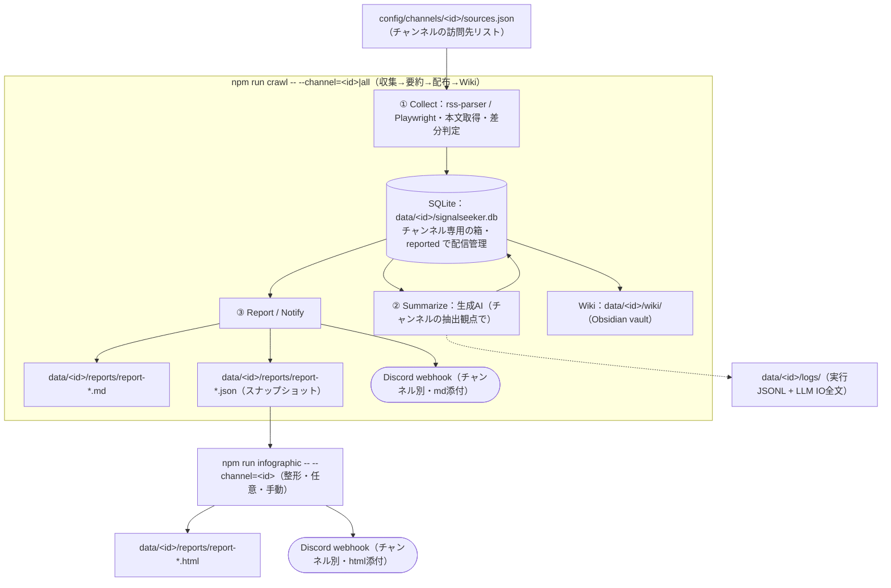
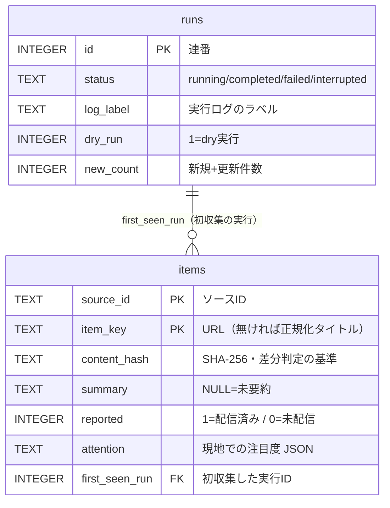
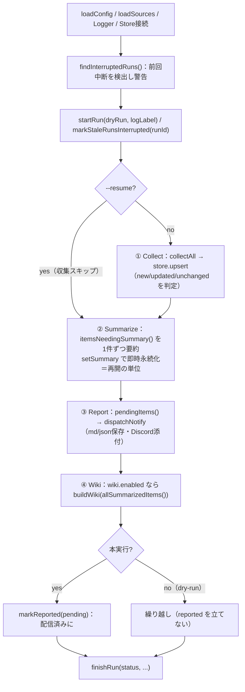
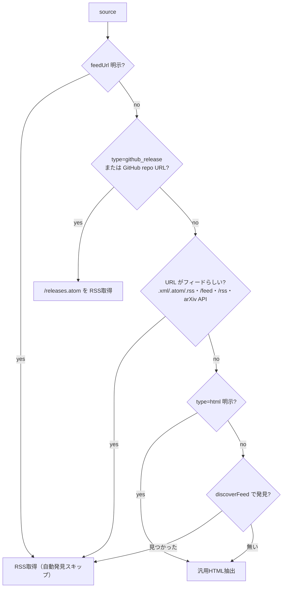
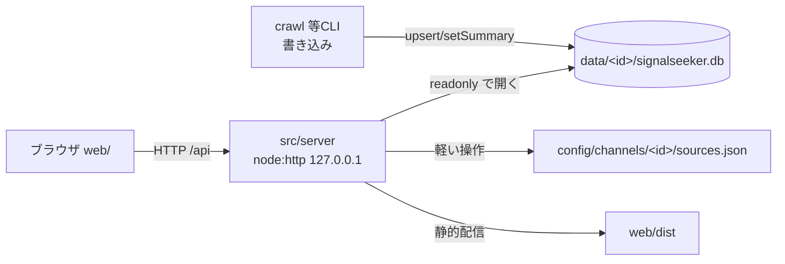

# SignalSeeker 設計書

本書は SignalSeeker の設計・開発者向けドキュメント。利用手順は `README.md` を参照。
機能追加・変更時は本書を更新すること(プロジェクト規約)。

最終更新: 2026-06-25

---

## 目次

1. [目的と方針](#1-目的と方針)
2. [全体アーキテクチャ](#2-全体アーキテクチャ)
   - 2.5 [マルチチャンネル(収集セットの分離)](#25-マルチチャンネル収集セットの分離)
3. [ディレクトリ構成](#3-ディレクトリ構成)
4. [データモデル](#4-データモデルsqlite-datasignalseekerdb) — [items](#items-テーブル) / [runs](#runs-テーブル) / [マイグレーション](#マイグレーション)
5. [処理フロー](#5-処理フローsrcindexts) — [状態と badge](#状態と-badge) / [dry-run](#dry-run-の意味重要) / [再開](#再開resume)
6. [LLM プロバイダ抽象](#6-llm-プロバイダ抽象srcllm) — [ストリーミングと長時間生成](#ローカルllmのストリーミングと長時間生成重要)
7. [収集](#7-収集srccollector) — [戦略の自動解決](#戦略の自動解決resolvestrategy) / [フィード自動発見](#フィード自動発見feed-discoveryts) / [本文取得と補完](#本文の取得と薄いフィードの補完)
8. [概要化](#8-概要化srcsummarizer)
   - 8.5 [キュレーション(重要度・注目度・集約)](#85-キュレーション重要度注目度集約-srccollectorattentionts-srccurationscorets) — [注目度](#現地での注目度シグナルenrichattention) / [スコア](#重要度スコアscoreitem) / [集約](#集約groupbyseries)
9. [レポート・通知](#9-レポート通知srcreport-srcnotify)
10. [Wiki](#10-wikiobsidian-srcwiki)
11. [ログ](#11-ログsrcloggerts)
12. [設定](#12-設定config) — [config.json](#configjson-主要項目) / [sources.json](#sourcesjson)
13. [コマンド一覧](#13-コマンド一覧)
14. [既知の制約・今後の拡張](#14-既知の制約今後の拡張)

---

## 1. 目的と方針

技術・AI分野の一次情報を自動収集し、客観ファクトの要約を蓄積・配信・知識ベース化する。

設計方針:

- **生成AIは「②概要化」だけに使う**。収集・差分判定・レポート・Wiki生成・設定は決定的処理。
- **取得先の選定だけで取得情報を変える**(`config/sources.json` が唯一のレバー)。
- **閾値はハードコードしない**。タイムアウト等はすべて `config.runtime` に集約。
- **場当たり的フォールバック禁止**。エラーは握って継続する箇所を明示し(収集・要約は記事/ソース単位)、
  それ以外は失敗を記録して落とす。
- **蓄積データを無駄にしない**。要約は永続化し、レポート・Wikiで再利用。中断後も再開可能。

---

## 2. 全体アーキテクチャ



段階と生成AIの使用:

| 段階 | 担当 | 生成AI | 説明 |
| --- | --- | :--: | --- |
| ① 取得 | `src/collector/` | × | rss-parser でフィード / Playwright で DOM・記事本文を抽出 |
| 差分判定 | `src/db.ts` | × | `content_hash`(SHA-256) で新規/更新を検知 |
| ② 概要化 | `src/summarizer/` + `src/llm/` | ○ | 4観点の客観ファクト抽出。**ここだけ LLM** |
| ③ 送付 | `src/report/` + `src/notify/` | × | Markdown整形 + Discord webhook / コンソール+ファイル |
| Wiki生成 | `src/wiki/` | × | 永続化済み要約から Obsidian vault を機械生成 |
| ログ | `src/logger.ts` | × | 実行イベント + LLM入出力を記録 |

---

## 2.5 マルチチャンネル(収集セットの分離)

ジャンルの異なる収集セット(AI技術 / 米国株 / 国内景気 / 国内企業 …)を「**チャンネル**」として分離し、
個別または一括で実行する。各チャンネルは以下をすべて独立に持つ:

- **設定**: `config/channels/<id>/{config.json, sources.json}`(完全独立。共有しない)。
- **箱(データ)**: `data/<id>/{signalseeker.db, reports/, wiki/, logs/}`(SQLite・レポート・Wiki・ログを分離)。
- **Discord 投稿先**: `config.notify.discordWebhookEnv` の環境変数名で解決(チャンネルごとに別 webhook)。
- **要約の抽出観点**: `config.extraction`(role + viewpoints)。日本語出力・客観性ルールは共通。

### 解決の中核(`src/channel.ts`)

`resolveChannel(id)` がチャンネルIDから決定的に `ResolvedChannel`(config / sources / paths / discordWebhook /
systemPrompt)を組み立てる。**箱のパスは config 値ではなくチャンネルIDから固定導出**(`data/<id>/…`)し、設定の
コピーミスでも箱が混ざらないことを保証する。`selectChannelIds(--channel)` が対象を決める:

- `--channel=<id>` … そのチャンネル。
- `--channel=all` … 全チャンネル(`config/channels/` 直下、先頭 `_`/`.` 除外)を順次。
- 未指定 … チャンネルが1つだけならそれ、複数あれば**一覧を出して終了**(黙って既定にしない=規約)。

### 各処理への注入

現状グローバル定数だったパス/ webhook/プロンプトを、`ResolvedChannel` から**引数で注入**する形に統一した
(`SqliteStore(paths.db)` / `notifyConsole(.., reportsDir)` / `writeSnapshot(.., reportsDir)` /
`resolveSnapshot(reportsDir, ..)` / `notifyDiscord(.., webhookUrl)` / `Logger({dir: logsDir})` /
`buildWiki(.., {vaultPath})` / `summarizeItems(.., systemPrompt)`)。レポート/通知の見出しには
チャンネル名 `[<name>]` を併記する。

---

## 3. ディレクトリ構成

```
config/
  channels/<id>/     チャンネル(収集セット)ごとの完全独立設定
    config.json      実行設定(name, LLM, notify+webhook環境変数名, extraction, collect, curation, wiki, runtime)
    sources.json     訪問先リスト(別ツール=npm run config -- --channel=<id> で保守)
src/
  index.ts           パイプライン本体(crawl / --dry-run / --resume / --channel)
  channel.ts         チャンネル探索・解決(箱/webhook/プロンプトをIDから導出)
  config.ts          設定ロード(パス引数・既定値適用)・保存、CHANNELS_DIR
  types.ts           型定義
  summarizer/prompt.ts  抽出観点(extraction)から System プロンプトを組立
  db.ts              SQLite ゲートウェイ(スキーマ・差分・クエリ)
  logger.ts          構造化ログ(JSONL + LLM IO全文)
  collector/
    index.ts         source.type で分岐、全ソース巡回
    rss.ts           rss / github_release(releases.atom 正規化)
    playwright.ts    html(一覧selector抽出 + 各記事本文取得)
  llm/               lllmAgents のプロバイダ抽象を模倣(スリム移植)
    base-provider.ts LLMProvider IF, Message/ChatParams/ChatChunk, collectResponse
    provider-factory.ts createProvider(endpoint, timeouts)
    anthropic.ts     Claude(@anthropic-ai/sdk)
    openai-compat.ts ローカル(ollama/lmstudio/llamacpp/vllm 共通, fetch)
    credentials.ts   "env:NAME" 解決
  summarizer/index.ts ファクト抽出プロンプトで要約 + LLM IOログ(出力は日本語統一)
  report/
    model.ts         buildReportModel: 構造化(スコア/集約/並べ替え)。md/htmlで共有
    markdown.ts      ReportModel → Markdown(カテゴリ→ソース→記事, run-id見出し)
    html.ts          ReportModel → HTMLインフォグラフィック(ダーク固定テーマ)
    snapshot.ts      report-<runLabel>.json の保存/読込/解決(再描画の契約)
    cli.ts           npm run infographic(スナップショットからHTML生成)
  notify/
    index.ts         有効な通知先へ fan-out + スナップショット保存
    console.ts       標準出力 + data/reports/report-<runLabel>.md 保存
    discord.ts       Webhook(本文=件数サマリ, レポート全文はmd添付, 429リトライ)
  wiki/
    index.ts         buildWiki: Notes/MOC/index を再生成
    cli.ts           npm run wiki(DBから再生成のみ)
  tools/
    db-view.ts       npm run db(stats/items/runs/search/item)
    config-edit.ts   npm run config(サブコマンド + 対話メニュー)
data/                gitignore。チャンネルごとに箱を分離:
  <id>/              signalseeker.db / reports/ / wiki/ / logs/(チャンネル専用)
docs/                設計・開発メモ(本書)
```

---

## 4. データモデル(SQLite `data/signalseeker.db`)



### items テーブル

| 列 | 型 | 説明 |
| --- | --- | --- |
| source_id | TEXT | ソースID(PK の一部) |
| item_key | TEXT | 記事の一意キー = URL(無ければ正規化タイトル)。PK の一部 |
| title | TEXT | タイトル |
| url | TEXT | 記事URL(エビデンス) |
| published_at | TEXT | 公開日時(取得できた場合) |
| content_hash | TEXT | `SHA-256(title + "\n" + rawText)`。**差分判定の基準** |
| raw_text | TEXT | 取得本文(maxContentChars 上限) |
| category | TEXT | カテゴリ(ソース設定由来) |
| source_name | TEXT | ソース表示名 |
| summary | TEXT | 生成AIによる要約。NULL=未要約 |
| reported | INTEGER | 1=本実行で配信済み。0=未配信(dry/中断分を含む) |
| attention | TEXT | 「現地での注目度」シグナル JSON(hfUpvotes/citationCount/ghStars/ghReactions/prerelease)。NULL=未取得 |
| first_seen_run | INTEGER | 初収集した実行ID(`runs.id`)。実行↔記事の追跡用。更新時は変えない |
| first_seen_at | TEXT | 初収集時刻 |
| last_seen_at | TEXT | 最終確認時刻 |

PK = `(source_id, item_key)`。

### runs テーブル

| 列 | 説明 |
| --- | --- |
| id | 連番 |
| started_at / finished_at | 開始・終了時刻 |
| dry_run | 1=dry実行 |
| status | `running` / `completed` / `failed` / `interrupted` |
| log_label | 対応する実行ログのラベル(`data/logs/run-<label>.jsonl`) |
| new_count | 新規+更新件数 |
| error | エラー要約(JSON) |

### マイグレーション

`db.ts` の `migrate()` が `CREATE TABLE IF NOT EXISTS` + `PRAGMA table_info` による
不足列 `ALTER TABLE` を行い、旧スキーマDBも前方互換で扱う。

---

## 5. 処理フロー(`src/index.ts`)



### 状態と badge

`SummarizedItem.state`:

- `new` … 今回新規収集
- `updated` … 本文(hash)変化
- `carried` … 過去のdry実行・中断から繰り越し(今回収集では unchanged だが未配信)

レポート/Discord で `🆕 / ♻️ / 📥` として表示。

### dry-run の意味(重要)

- dry実行でも **収集・upsert・要約・要約の永続化・レポートのファイル保存・Wiki生成は行う**。
- 異なるのは **`reported` を立てない(配信済みにしない)** ことと **Discord通知をしない** こと。
- よって dryで取得・要約した記事は **次の本実行(`crawl`)のレポートに `carried` として繰り越される**。
- レポートは `data/reports/report-<runLabel>.md` に保存(実行ごとに一意。1日複数回でも上書きしない)。

### 再開(resume)

- 要約は1件ごとに永続化されるため、クラッシュしても再実行で `itemsNeedingSummary()` が残りだけ返す。
- `--resume` は収集をスキップし、既収集の未処理分(未要約・未配信)から再開する。
- 起動時、前回の `status=running` のまま終了した run を検出して警告し、当該以外を `interrupted` に確定。

---

## 6. LLM プロバイダ抽象(`src/llm/`)

`claudeclone/lllmAgents` の providers 設計をスリムに模倣。

- **`LLMProvider`**: `providerType` / `testConnection()` / `chat(params): AsyncGenerator<ChatChunk>`。
- **`ChatChunk`**: `text` / `done`(usage付き) / `error`。
- **`collectResponse(gen)`**: ストリームを `{ text, usage }` に畳む(単発要約に最適)。
- **`createProvider(endpoint, timeouts)`**: `providerType==="anthropic"` → `AnthropicProvider`、
  それ以外(ollama/lmstudio/llamacpp/vllm) → `OpenAICompatProvider`(OpenAI互換 `/v1/chat/completions`)。
- **切替はコード変更不要**。`config.llm.endpoint` を差し替えるだけ。`apiKey` は `"env:NAME"` 解決可。
- タイムアウトは `config.runtime.http`(llmChatTimeoutMs / llmTestTimeoutMs)から注入。

`endpoint` 形:`{ providerType, model, baseUrl?, apiKey? }`。ローカル系は `baseUrl` 必須
(ollama/lmstudio は既定あり)。

### ローカルLLMのストリーミングと長時間生成(重要)

低速ローカルLLM(数 tok/s の reasoning モデル等)は1記事の生成に数十分かかり得る。これを取りこぼさないため:

- **`OpenAICompatProvider` は `stream:true`(SSE)で受信**する。Node 内蔵 fetch(undici)の `bodyTimeout`
  は「**チャンク間の無通信時間**」で測るため、トークンが流れ続ける限り発火しない。
- さらに undici の **`Agent({ headersTimeout, bodyTimeout })` を `llmChatTimeoutMs` に明示設定**し、
  Node 既定の隠れた上限(約 300 秒)を撤廃する。これで「待てる上限 = config の値」になり、
  30分でも1時間でも config 次第で待てる(以前は 300 秒で `fetch failed` していた)。
- 全体上限は `AbortSignal.timeout(llmChatTimeoutMs)`。SSE は `delta.content` のみ採用
  (reasoning モデルの `delta.reasoning_content` は無視)、`usage` は `stream_options.include_usage` で取得。
- エラーは `err.cause`(`UND_ERR_HEADERS_TIMEOUT` / `ECONNREFUSED` 等)まで文字列化してログに残す
  (`fetch failed` だけにしない)。

---

## 7. 収集(`src/collector/`)

**特定URLに特化させない**のが方針。ソースは原則「サイトURL + カテゴリ」だけでよく、取得手段(戦略)は
収集側が自動解決する。フィードURL・CSSセレクタの直書きは任意の最適化に留める。

### 戦略の自動解決(`resolveStrategy`)



選択した戦略は `collect_source`(strategy/feedUrl)としてログに残す。0件時は `collect_source_empty` を警告。

### フィード自動発見(`feed-discovery.ts`)

サイト固有知識を持たず、汎用2手段のみ: ① トップHTMLの `<link rel="alternate" type="application/(rss|atom)+xml">`、
② よくあるフィードパス(`/rss.xml`, `/rss`, `/feed`, `/feed.xml`, `/atom.xml`, `/index.xml` をパス基準・オリジン基準で)
の総当たりを、XMLらしさで検証して採用。

### 本文の取得と薄いフィードの補完

| 戦略 | 一覧 | 本文 |
| --- | --- | --- |
| rss/github_release | `feed.items` | `content`→`summary`→`contentSnippet`(タグ除去) |
| html | `selector` 指定時はそれ、無ければ汎用ヒューリスティック(同一ホスト・本文長・深い階層) | 記事ページの `article/main/[role=main]/body` を汎用抽出 |

- **薄いフィードの補完**: RSS本文が `collect.articleBodyMinChars`(既定400)未満なら、記事ページ本文を
  Playwright の汎用抽出(`fetchArticle`、サイト別セレクタ不要)で補完し `content_hash` を更新する。
  DeepMind 等のタイトル+短文しか持たないフィードでも、要約に足る本文を確保する。
- **同一ホスト最小間隔(`collect.perHostMinIntervalMs`、既定4000ms)**: 同じホストへの連続アクセスは
  この間隔まで待つ(メイン取得・本文補完の両方に適用)。Reddit 等のレート制限(429)対策。
- `content_hash` で差分判定。`maxContentChars` で保持・要約量を制御。
- タイムアウト: `runtime.http.rssTimeoutMs`、`runtime.playwright.navTimeoutMs / articleTimeoutMs`。
- 失敗はソース単位で握り、`errors[]` とログに記録して継続。

> **Reddit**: `r/A+B+C/hot/.rss` で複数サブレを1リクエストに束ねて Hot 話題を、`search.rss?q=...` で
> キーパーソンの話題を収集する。Reddit は**カスタム User-Agent を 429 で弾く**ため、rss-parser の既定UAの
> まま使う(独自UAを付けない)。検索フィードはレート制限が厳しく最善努力。
> なお X/Twitter はログイン必須で本機構では取得不可(対応方針は別途)。

---

## 8. 概要化(`src/summarizer/`)

システムプロンプトで**客観ファクトのみ**を箇条書き抽出(煽り・意見・宣伝を排除)。抽出観点は
**チャンネルの `config.extraction`(role + viewpoints)** から `summarizer/prompt.ts` の `buildSystemPrompt()` で
組み立てる。`summarizeItems(.., systemPrompt)` にプロンプトを注入する(ハードコードしない)。

- 例(AI技術チャンネル)の観点: 1. 技術的仕様変更 / 2. アーキテクチャの提案 / 3. OSSの破壊的変更 / 4. 実運用上の課題。
  米国株なら「業績・ガイダンス/資本政策/規制・金利/銘柄動向」等、ジャンルに合わせて差し替える。
- 「ファクト無し」標準句は全チャンネル共通(`- 抽出すべきファクトなし`)で、`curation/score.ts` の判定とも揃える。
- 入力 = タイトル+URL+本文。出力上限は `runtime.summarize.maxOutputTokens`(既定 8000)。
  reasoning モデルは推論にもトークンを消費するため大きめにする(小さいと推論で使い切り content が空になる)。
- **出力言語は日本語に統一**(プロンプトで明示)。原文が英語でも説明文は日本語に翻訳する。ただし
  **固有名詞・製品名・モデル名・OSS名・API名・コード/コマンド・バージョン番号・正式名称は原文のまま**残す
  (無理にカタカナ化しない)。過去に生成済みの要約の再翻訳は行わない(今後の要約のみ適用=ユーザ判断)。
- **その場リトライ**: 失敗時は `runtime.summarize.maxRetries` 回まで指数バックオフ
  (`retryBackoffMs * 2^(n-1)`)で再試行。試行ごとに個別の LLM IO ログを残す(通番 `n`、`context.attempt`)。
- **後で穴埋め**: 全試行失敗の記事は `summary=null` のまま。`index.ts` は要約成功分のみ `reported=1` にするため、
  失敗記事は `reported=0/summary=null` で残り、**次回実行の `itemsNeedingSummary()` で自動再要約**される
  (恒久消失しない)。レポートには当該記事を「要約を取得できませんでした」と表示して穴を可視化する。
- 各呼び出しの input/output/usage/ms/error を Logger で**全文記録**。

> ローカル reasoning モデル(例 gemma)は `reasoning_content` を別に返すが、`content`(最終回答)のみ採用する。

---

## 8.5 キュレーション(重要度・注目度・集約)(`src/collector/attention.ts`, `src/curation/score.ts`)

一次情報を「ただ並べる」のでなく、**現地での注目度**を加味して重要度順に整理し、重複を畳む。

### 現地での注目度シグナル(`enrichAttention`)

収集した記事の URL から取得先を判定し、外部APIで注目度を取得して `items.attention`(JSON列)へ永続化する。
取れないシグナルは `undefined`(=スコアに寄与しない)。失敗は記事単位で握り全体は止めない。

| 対象 | シグナル | API | 認証 |
| --- | --- | --- | --- |
| arXiv論文 | HF Papers の upvote | `huggingface.co/api/papers/{id}` | 不要(404=ページ無し→シグナル無し) |
| arXiv論文 | 引用数 | `api.semanticscholar.org/.../arXiv:{id}` | `S2_API_KEY` 任意(無いと429になりやすい) |
| GitHubリリース | star数・reaction合計・prerelease判定 | `api.github.com/repos/...` | 不要(`GITHUB_TOKEN` で上限緩和) |

- GitHub のリポジトリ単位呼び出し(star/releases一覧)は**1リポジトリ1回**にキャッシュ。
- 取得は `config.curation.fetchTimeoutMs`、ON/OFF は `config.curation.sources.{hfPapers,semanticScholar,github}`。

### 重要度スコア(`scoreItem`)

`score = w.recency·鮮度 + w.attention·注目度 + w.content·内容`(重みは `config.curation.weights`)。

- **鮮度**: `publishedAt` からの経過日数で指数減衰(半減 `recencyHalfLifeDays` 日)。
- **注目度**: upvote/引用/reaction を log 正規化し最大値を主、star を補助(0.2)で合成。
- **内容**: ファクト無し=0 / 「破壊的変更」を含む=1 / それ以外で要約あり=0.5。
- **降格**: `prerelease`(RC等)または内容0 の記事は `demoteFactor`(既定0.3)を掛けて下げる。

### 集約(`groupBySeries`)

同一リリース系列(タイトルの基準バージョンが同じ。`v0.23.0rc0/rc2/...` 等)を1グループに畳み、
代表(系列内最高スコア)を主表示・残りは折りたたみにする。`config.curation.groupReleaseSeries` で切替。

### ファクト抽出なし記事の扱い(`isNoFacts`)

要約が「ファクト無し標準句」に一致する記事(`score.ts` の `isNoFacts`)は、本文を出さず**ソース末尾に
`<details>` 折りたたみでタイトル+リンクのみ**を列挙する(`参考(ファクト抽出なし) N件`)。読み手のノイズを減らし、
それでも原典に飛べるよう参照は残す方針。LLM 側のマーカー出力は内部判定(未要約との区別・スコア降格)に必要なため
維持する。`buildReportModel` がソース単位でファクトあり/なしに分離し、`SourceBlock.groups`(本文描画)と
`SourceBlock.noFacts`(リンクのみ)に振り分ける。未要約(要約 null/空)はこれに含めず、従来どおりプレースホルダ表示。

> レポート/Wiki は `rankByScore` 時、カテゴリ・ソース・記事をスコア降順に並べ替える。Wiki は frontmatter に
> `score` / `hf_upvotes` / `citations` / `gh_reactions` / `gh_stars` を出力し Obsidian 側で並べ替え可能にする。

---

## 9. レポート・通知(`src/report/`, `src/notify/`)

### 構造化モデルと描画の分離(`report/model.ts`)

Markdown と HTML が**同じ内容**になるよう、「構造化」と「描画」を分離する。
`buildReportModel(result, curation, opts)` が スコア付与→カテゴリ/ソース集約→`groupBySeries`→
`rankByScore` 並べ替え→件数集計までを行い `ReportModel` を返す(`opts` で `runId`/`date`/`kind`/`period` を渡す)。
`ReportModel` は `kind`("daily"/"weekly")と `period` を持ち、Markdown(`report/markdown.ts`)と
HTML(`report/html.ts`)はこの同一モデルから描くため、並び順・件数・グルーピングが必ず一致する。
見出し・集計表記・状態バッジの有無だけ `kind` で分岐する(本文構造は共通)。

- **Markdown**: `# SignalSeeker レポート <date> (run #<id>)` → **カテゴリ別件数の Mermaid 円グラフ**
  (`pie showData`) → 目次 → カテゴリ → ソース → 記事。重要度★・注目度バッジ・リンク・要約。
  同一リリース系列は代表+`<details>`折りたたみ。ファクト抽出なし記事はソース末尾に参照リンクのみ折りたたみ。
  Mermaid は GitHub/Obsidian/VSCode 等でレンダリングされる。
- **見出しに run-id を併記**。`runs.id` を `RunResult.runId` で受け渡す(`npm run db -- runs` でも確認可)。
- **console**: 標準出力 + `data/reports/report-<runLabel>.md` 保存(常時)。
- **収集エラーはレポートに載せない**(運用ログの領分)。`errors` は JSONL ログと `runs.error` に残す。

### スナップショット(再描画の契約, `report/snapshot.ts`)

配布時に `data/reports/report-<runLabel>.json` を保存する(dry-run でも保存)。中身は
`{ runId, runLabel, generatedAt, date, counts, summarized, kind?, period? }`。これが**収集・要約を再実行せずに**
後からHTML等へ再描画するための入力契約。`resolveSnapshot({runId|label|latest})` で1件解決する
(見つからなければ理由を Error で明示。握りつぶさない)。`kind`/`period` が無い旧スナップショットは日次として扱う。

### Discord(全文を添付ファイルで送る, `notify/discord.ts`)

`DISCORD_WEBHOOK_URL`(.env)へ送信。**本文(content)は件数サマリ+run-id の短文のみ**にし、
**レポート全文は `report-<runLabel>.md` を添付ファイル**として送る(`multipart/form-data` の
`payload_json` + `files[0]` を1リクエストで)。これにより embed の4096字制限で本文が欠ける問題を解消。

- 旧実装の per-item embed・10件分割・4000字切り捨ては**廃止**(欠落の原因のため)。
- 添付が8MB上限を超える場合は警告ログで明示(現実的には起きない)。429は `discordRetryUnitMs` でリトライ。
- 送付先は `config.notify.targets`。`--dry-run` は discord をスキップ(console保存とスナップショットは行う)。

### HTML インフォグラフィック(独立コマンド, `report/html.ts` + `report/cli.ts`)

「見栄え・可読性を上げたいときだけ」実行する**独立コマンド**(収集・要約・配布とは分離)。
スナップショットから `ReportModel` を組み、**ダーク・ダッシュボード固定テーマ**のHTMLを描画する。

- `npm run infographic -- --channel=<id> [--run=<id> | --label=<label> | --latest] [--no-discord]`(既定 `--latest`)。
  出力 `data/<channel>/reports/report-<runLabel>.html`。スナップショットはチャンネルの reports から解決する。
- **手動実行でも Discord へ送付**する: `config.notify.targets` に `discord` があり、そのチャンネルの webhook
  (`notify.discordWebhookEnv` の環境変数)が設定されていれば、生成した HTML を添付して送る。`--no-discord` で抑止。
  HTML はインライン化された自己完結ファイルなので、Discord からダウンロードしてそのまま開ける。
  なお HTML 自体は外部依存を避けるため Mermaid を使わず、ネイティブなカード/バッジで描画する
  (Mermaid を使うのは Markdown レポートと本設計書)。
- テーマは1か所(`THEME` 配色 + テンプレート)に固定し、実行ごとに変わらない。配色は濃紺×シアン、
  カテゴリを大セクション・ソースをカード・記事に状態バッジ/★スコア/注目度チップ・要約箇条書き、
  同系列・ファクト抽出なし記事は `<details>` 折りたたみ。**外部CSS/JS/フォント/画像なしの完全自己完結HTML**(単体で開ける)。
- npm 経由では `--run <id>`(空白区切り)が npm に横取りされるため、引数は **`--flag=value`** 形式を推奨。
  CLI は両形に対応。run-id はレポート見出し/`npm run db -- runs`/crawl のコンソール出力で確認できる。

### 週次相当(期間)レポート(`report/weekly-cli.ts`)

新規取得はせず、**蓄積済みデータを期間で切り出して**振り返るレポート。日次の配信状態(`reported`)に依存せず、
`store.allSummarizedItems()` を **収集日(`first_seen_at`)** で窓掛けする(JS 側で `YYYY-MM-DD` 比較。`first_seen_at`
は常に ISO なので安全。`Store` 抽象は変更しない)。日次の配布パイプラインとは独立したコマンド。

- `npm run weekly -- --channel=<id>|all [--days=N] [--until=YYYY-MM-DD]`。
- **終端 `end`** = `--until` 指定値、無ければ最後の収集日(`first_seen_at` の最大)。**「今から7日」ではない**。
- **開始 `start`** = `end` の (N-1) 日前。`--days` は既定7・**最大15**(1..15 以外はエラーで停止、無言クランプしない)。
- 採用条件: `start <= first_seen(YYYY-MM-DD) <= end`。該当0件でもレポートは生成する。
- 出力: `data/<channel>/reports/report-weekly-<end>-<days>d.md` と同名 `.json`(スナップショット、`kind:"weekly"` + `period`)。
- 週次は収集日で窓を切るため記事の状態(新規/更新/繰越)は一律になり無意味 → **状態バッジは省く**。集計は
  「対象期間の記事: N件(収集日ベース)」。
- **HTML化は手動**: 案内に従い `npm run infographic -- --channel=<id> --label=weekly-<end>-<days>d` を実行する。週次スナップショットの
  `kind`/`period` から週次タイトルで描画し、Discord 本文も週次サマリに切り替わる(`--no-discord` で抑止)。
  週次コマンド自身は Discord 送付しない(Markdown はローカル保存のみ)。
- **月次は未実装**。月次は再出現頻度など別軸で扱う想定で、最大15日の週次相当とは分ける(§14)。

---

## 10. Wiki(Obsidian, `src/wiki/`)

DB の要約済み全件から Obsidian vault を**冪等に再生成**(AIは使わず、保存済み要約を再利用)。

```
data/<channel>/wiki/
  index.md                  ルートMOC(カテゴリ一覧+件数)
  MOC/MOC <カテゴリ>.md      カテゴリ別MOC(ソースでグループ化し [[wikilink]])
  Notes/<slug>-<hash8>.md   記事ノート
```

- 記事ノート: frontmatter(`title/source/url/site/category/tags/published/collected/updated`)、
  階層タグ `category/…`・`source/…`、AI要約、本文抜粋、**エビデンスリンク**、カテゴリMOCへの戻りリンク。
- **検索・グラフ・タグ絞り込みは Obsidian 標準機能**に委譲。
- 管理対象は `Notes/`・`MOC/`・`index.md` のみ(毎回再生成)。他の手書きノートは置かない。
- 現状(MVP)はグループ化をメタデータで機械的に実施。AIによるテーマ抽出は将来拡張(`src/wiki/` 差替)。

---

## 11. ログ(`src/logger.ts`)

- **実行ログ**: `data/<channel>/logs/run-<runLabel>.jsonl`。各イベント(run_start[channel付き], collect_source,
  summarize_*, llm_call, report_saved, discord_*, wiki_built, run_completed/failed 等)を1行JSON。
- **LLM IO**: `data/<channel>/logs/llm/<runLabel>-<n>.json` に input(system+messages)/output/usage/ms/error/context を
  **全文**保存。`runtime.logging.maxIoChars`(0=無制限)で上限可。
- `runLabel` は ISO時刻ベースで実行を一意識別。`runs.log_label` と突合可能。
- コンソール出力は `runtime.logging.level` 以上のみ。

---

## 12. 設定(`config/channels/<id>/`)

設定は**チャンネルごとに完全独立**。`config/channels/<id>/config.json` + `sources.json`。

### config.json 主要項目

```jsonc
{
  "name": "AI・技術",                              // チャンネル表示名(見出しに併記)
  "llm": { "endpoint": {providerType, model, baseUrl?, apiKey?}, "deepEndpoint": {…} },
  "notify": { "targets": ["console","discord"], "discordWebhookEnv": "DISCORD_WEBHOOK_URL" },  // webhookは環境変数名で指定
  "extraction": { "role": "…抽出器", "viewpoints": ["観点1","観点2",…], "noFacts": "- 抽出すべきファクトなし" },
  "firstRunLimit": 5,
  "collect": { "maxContentChars": 8000, "fetchArticleBody": true, "articleBodyMinChars": 400, "perHostMinIntervalMs": 4000 },
  "curation": {
    "rankByScore": true, "groupReleaseSeries": true, "enrichAttention": true,
    "sources": { "hfPapers": true, "semanticScholar": true, "github": true },
    "fetchTimeoutMs": 15000,
    "weights": { "recency": 0.4, "attention": 0.4, "content": 0.2 },
    "recencyHalfLifeDays": 7, "demoteFactor": 0.3
  },
  "wiki": { "enabled": true, "defaultTags": ["signalseeker"] },  // vaultPath は data/<id>/wiki に固定導出
  "runtime": {
    "http": { llmChatTimeoutMs, llmTestTimeoutMs, rssTimeoutMs, discordTimeoutMs, discordRetryUnitMs },
    "playwright": { navTimeoutMs, articleTimeoutMs },
    "summarize": { maxOutputTokens, maxRetries, retryBackoffMs },
    "logging": { level, maxIoChars }   // dir は data/<id>/logs に固定導出
  }
}
```

`config.ts` の `loadConfig(configPath)` が必須検証と既定値適用を行う。閾値はすべて `runtime` 配下にあり、
**コードにハードコードしない**(規約)。`wiki.vaultPath` / `logging.dir` を書いても、箱の分離保証のため
`channel.ts` が `data/<id>/…` で上書きする。webhook URL は `.env` に置き、`discordWebhookEnv` の名前で参照する。

### sources.json

`{ id, name, url, category, enabled, type?, feedUrl?, selector?, maxLinks? }` の配列(チャンネルごと)。
- `url` はサイトトップでもフィードでも可(フィードは自動発見)。`type`/`feedUrl`/`selector` は**任意**で、
  通常は不要。指定すると自動判定/発見を省略できる(特定URLへの依存は最小限に留める)。
- `npm run config -- --channel=<id>` で保守(別ツール想定)。新規チャンネルは空配列から始め、ソースを足していく。

---

## 13. コマンド一覧

すべてのコマンドは **`--channel=<id>`** で対象チャンネルを指定する(`crawl`/`weekly`/`wiki` は `--channel=all` で
全チャンネル順次。未指定はチャンネルが1つだけならそれ、複数なら一覧を出して終了)。npm 経由では **`=` 形式**を推奨。

| コマンド | 説明 |
| --- | --- |
| `npm run crawl -- --channel=<id>\|all` | 収集→要約→レポート/通知→Wiki(配信済み化) |
| `npm run crawl:dry -- --channel=<id>` | 通知せず・配信済みにしない(次の本実行に繰り越し) |
| `npm run crawl:resume -- --channel=<id>` | 収集スキップしDBの未処理分から再開 |
| `npm run wiki -- --channel=<id>\|all` | DBの蓄積から Obsidian vault のみ再生成 |
| `npm run weekly -- --channel=<id>\|all [--days=N\|--until=YYYY-MM-DD]` | 蓄積データから週次相当(最大15日)レポートを生成 |
| `npm run infographic -- --channel=<id> [--run=<id>\|--label=<label>\|--latest] [--no-discord]` | スナップショットから HTML生成+Discord送付 |
| `npm run db -- --channel=<id> <cmd>` | DB閲覧(stats/items/runs/search/item) |
| `npm run config -- --channel=<id> [<cmd>]` | 設定メンテ(対話メニュー / サブコマンド) |
| `npm run serve` | ローカル Web サーバ(閲覧UI + API)を 127.0.0.1:8787 で起動(§15) |
| `npm run typecheck` | 型チェック |

---

## 14. 既知の制約・今後の拡張

### ストレージの差し替え可能性

- 生SQL・`better-sqlite3` は **`db.ts` のみ**に閉じ、呼び出し側は **`interface Store`** 経由
  (実装は `SqliteStore`)。別DBへ移す場合は `Store` を実装した新クラスを作り、生成箇所
  (`index.ts` / `wiki/cli.ts` / `tools/db-view.ts`)を差し替えるだけ。
- **注意(同期/非同期)**: 現実装は同期API。Postgres等の**非同期**ドライバへ移す場合は `Store` を
  Promise 返しへ変更し、呼び出し側に `await` を波及させる必要がある。ここが「最小変更」の唯一の崩れ所。

### 多期間レポート(週/月/四半期/年/…/全体)の設計方針

- **週次相当(最大15日)は実装済み**(`npm run weekly`、§9)。収集日で窓を切り、日次と同じ描画資産で出す
  「期間内の記事一覧」。**月次以上は未実装**で、これとは**別の観点**(下記の再出現頻度)で設計する。両者を混ぜない。
- 月次以上の方針: **注目度の数値推移は追わない**(社会的インパクトを数値で正確に測るのは筋が悪く、コスト過大)。
  代わりに **題材の再出現頻度をホット度の軸**とする —— 「別ソース/別投稿で同じ題材が何度も現れる=注目」、
  「1回きりの話題=それほどでもない」。
- データ的にこれは実現可能: items は**削除せず累積**し、`published_at`/`first_seen_at`/`first_seen_run`/
  カテゴリ/ソース/タイトルを保持する。期間でバケツ化し、題材でグルーピングして件数・ソース数を数えれば
  再出現頻度が出せる。→ 重い「注目度スナップショット履歴」テーブルは**不要**。
- 残作業は**レポート層の機能**(期間集計 + 題材の横断グルーピング)であり、データモデルの作り直しではない。
  題材グルーピングは将来 `groupBySeries` の発展(タイトル正規化/簡易クラスタリング)で対応。

### その他

- arXiv は RSS が空になりがちなため公式 Atom API(`export.arxiv.org/api/query`)を使用。
- ローカル reasoning モデルは低速(数分/件)。`firstRunLimit` 低減・量子化モデル・Claude併用で調整。
- 拡張候補: Wikiのカテゴリ概観をAI生成、`deepEndpoint` による重要記事の深掘り、
  暗号化APIキー(lllmAgents の CredentialVault 移植)。
- **全文検索のFTS5化は実装済み**(§15。`items_fts` trigram)。

---

## 15. Web クライアント(`src/server/`, `web/`)

CLI(収集・要約・通知=**書き込み経路**)はそのままに、**閲覧中心の常設UI**を別系統で追加する。
全チャンネル横断の俯瞰・全文検索・レポート/履歴閲覧・ソース設定管理を1画面群で提供する。

### 構成と安全モデル



- **読み取り専用**: server は各チャンネルDBを `new SqliteStore(path, {readonly:true})` で開く(migrate/WAL/mkdir をスキップ)。
  WAL なので収集中でも同時読みで競合しない。スキーマ変更(FTS含む)は **CLI 側 migrate のみ**が行う。
- **軽い操作は sources.json のみ**: 追加/有効無効/削除は `config/channels/<id>/sources.json` を原子的に書き換える
  (DB は触らない=走行中 crawl と非干渉。反映は次回 crawl)。検証は `src/server/sources.ts`(対話CLIと共有)。
- **秘密を出さない**: 127.0.0.1 のみ bind。`discordWebhook`(URL)はレスポンスに含めず有無のみ。`config` 取得時は
  平文 `apiKey` を伏字化(`env:` 参照は安全なので保持)。
- **フレームワーク非依存のバックエンド**: `node:http` + 小さな自前ルータ(`src/server/router.ts`)。新規runtime依存なし。

### API(`src/server/api.ts`)

読み取り: `GET /api/channels`・`/api/triage`(横断スコア上位)・`/api/search`(横断全文検索)・
`/api/channels/:id/{stats,items,items/:sourceId/:itemKey,runs,reports,reports/:label,sources,config}`。
`reports/:label` は `modelFromSnapshot`(`report/snapshot.ts`)で **ReportModel** を返し、Markdown/HTML と同一構造を保つ。
記事一覧/詳細には `scoreItem`(`curation/score.ts`)で算出した重要度スコアを付ける。

軽い操作: `POST/PATCH/DELETE /api/channels/:id/sources[/:sourceId]`。検証失敗は 400、対象なしは 404、未収集DBは 409。

### 全文検索(FTS5・trigram)

日本語(分かち書きなし)対応のため **`items_fts`(FTS5, `tokenize='trigram'`)** を使う。`SqliteStore.migrate()` で
テーブル+items への INSERT/UPDATE/DELETE トリガを作り常時同期、既存データは初回バックフィルする。
trigram は **3文字以上**でしか引けないため、**2文字以下のクエリは従来の LIKE(`searchItems`)**にフォールバックする
(仕様上の分岐であり場当たりではない)。横断検索は全チャンネルのDBを順に引いて結合する。

### フロントエンド(`web/`)

Vite + React + react-router(独自 `package.json` で依存を隔離)。配色は `report/html.ts` の `THEME` に合わせる。
6画面: **概要(横断トリアージ+チャンネルカード)/チャンネル(絞り込み+検索)/記事詳細/レポート一覧+実行履歴/
レポート閲覧(ReportModel描画)/設定(ソース管理+config閲覧)**。dev は Vite が `/api` を server へプロキシ、
本番は `npm run build` の `web/dist` を server が配信(未知パスは SPA フォールバックで `index.html`)。
